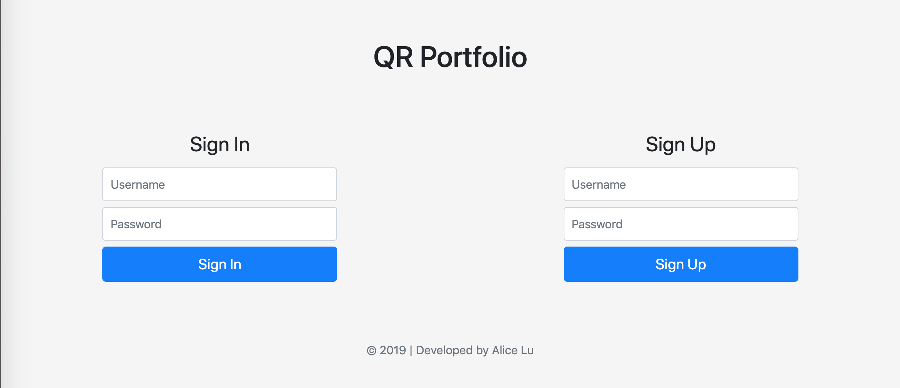

# Barracoda

## Overview

For smaller, less tech oriented corporations, clients still print out customer receipts without any barcode or QR code to uniquely indentify them. Unfortunately, customers can easily photocopy them or fake another one with today's technology. To prevent customers from picking up products they've already recieved or shouldn't be recieving, these corporations should use Barracoda.

Barracoda is a web app that allows clients to create customer profiles and record their order history. Every order invoice will have a new QR Code generated and printed on the receipt. When these customers go in store to pickup their order, they will provide this QR code to the supplier. The supplier will then scan the QR Code, prompt the customer for a signature, and mark it delivered.

## Data Model

The application will store Customers, Orders, and Items

* Customers can have multiple orders (via references)
* Orders can have multiple items (via references) 

An Example Customer:

```javascript
{
    // required fields
    firstName: String, // customer's first name
    lastName: String, // customer's last name
    phoneNumber: String, // customer's phone number in XXX-XXX-XXXX format
    // optional fields
    slug: String, // autogenerated
    orders: [Order], // array customer's orders 
}
```

An Example Order Invoice: 

```javascript
{
    // required fields
    invoiceID: Number, // auto incremented 
    client: String, // client issuing order
    items: [Item], // list of purchased goods

    // optional fields
    totalAmt: Number, // total cost of items, autocompleted
    paidOff: Boolean, // payment status of order
    pickedUp: Boolean, // pickup status of order
    supplier: String, // supplier delivering order
}
```

An Example Item: 

```javascript
{
    // required fields
    quantity: Number, // quantity requested for item 
    itemName: String, // name of item
    price: Number, // price of item
}
```

## [Link to First Draft Schema](db.js) 

## Wireframes

/login - page for login (admins only)


/home - page for searching customers


/customer-profile/slug - page for showing customer profile


/customer-new - page for creating new customer


/order-new - page for creating new order


## Site Map
 

## User Stories or Use Cases

1. as non-registered user, I will not have access to the site
2. as an admin, I can log in to the site
3. as an admin, I can create a new customer profiles
4. as an admin, I can create a new order for customers
5. as an admin, I can search customers by name or telephone number
6. as an admin, I can view all customers created
7. as an admin, I can view the order invoice history for each customer
8. as an admin, I can file a new orders for customers

## Research Topics

* (2 points) [Bootstrap]()
  * A front-end component library for developing with HTML, CSS, and JS
  * Used to build responsive, mobile-first projects on the web
  * Will focus the research more on the responsive grid system 
* (3 points) [QR Code API](http://goqr.me/api/)
    * API to generate and process QR codes 
    * Needed for suppliers to issue an order pickup confirmation
    * Small library but requires much more research and testing on mobile, so I have assigned it 4 points.
* (5 points) React.js
    * A frontend framework for designing the UI with components and states
    * Used to update and render only necessary components when data changes
    * Challenging library to learn, so I've assigned it 5 points

10 points total out of 8 required points 

## [Link to Initial Main Project File](app.js) 

## Annotations / References Used

1. [Bootstrap 4](https://getbootstrap.com/)
2. [QR Code API](http://goqr.me/api/) 
3. [React](https://reactjs.org/)