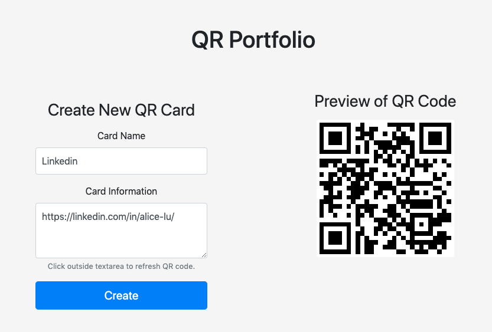
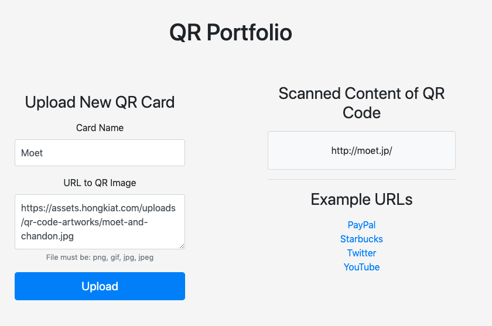
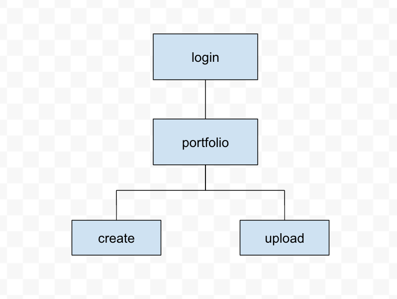

# QR Portfolio

## Run 
```
mongod
npm start
```

## Overview

Not everyone carries around their stack of business cards or other identification cards with them at all times. They also prefer not to bring a giant card holder to recieve other people's cards at events or coffee chats. Moreover, it's also pricy to order personalized cards and card holders. This is where an online QR Portfolio comes in handy.

QR Portfolio allows you to create an online portfolio that stores QR codes. You can create a custom QR code with your desired information in it, whether it be regarding your business, education, medical background, etc. You can also collect other QR codes you see online by including a link to the QR code image. In all, this free service is incredibly handy for professionals, students, artists, and practically everyone else!  

## Data Model

The application will store Users and Cards

* Users can have multiple Cards (via references)

An Example User:

```javascript
{
    // required fields\
    username: String, // account name, unique
    password: String, // account password
    // optional fields
    cards: [Cards], // user's cards
}
```

An Example Card: 

```javascript
{
    // required fields
    cardname: String, // name of card, unique
    qrcode: String, // api of qr code
    // optional fields
    text: String, // qr code text
}
```

## [Link to First Draft Schema](db.js) 

## Wireframes

/ - page for signin or signup


/portfolio - page for viewing, searching, and deleting QR cards


/create - page for creating QR cards


/upload - page for uploading QR cards


## Site Map
 

## User Stories

1. as non-registered user, I can sign up for an account
2. as a user, I can log in to the site
3. as a user, I can log out of the site
4. as a user, I can create new QR cards
5. as a user, I can upload QR cards from fileurls
6. as a user, I can expand the view of a QR card
7. as a user, I can delete QR cards
8. as a user, I can search QR cards

<!-- ## Research Topics

* (2 points) Bootstrap
    * A front-end component library for developing with HTML, CSS, and JS
    * Used to build responsive, mobile-first projects on the web
    * Research focused on webpage responsitivity and the grid system
* (4 points) QR Code API
    * API to generate and process QR codes 
    * Used to read existing QR code and to create new ones for the user portfolio
    * Small library but requires: testing on mobile, using the request server-side JS module, and understanding cors.
* (3 + 2) Gulp + Concatenation and minification of CSS and JS files
    * Toolkit for automating time-consuming tasks during development, 
    * Needed to automatically concatenate and minify CSS and JS on file change  
    * Optimizes browser performance for reading files and lessens the number of file requests made.

11 points total out of 8 required points  -->

## [Link to Initial Main Project File](app.js) 

## Annotations / References Used

1. [Bootstrap 4](https://getbootstrap.com/)
2. [QR Code API](http://goqr.me/api/) 
3. [Gulp](https://gulpjs.com/)
4. [Concatenation and Minification of CSS and JS](https://www.toptal.com/javascript/optimize-js-and-css-with-gulp)